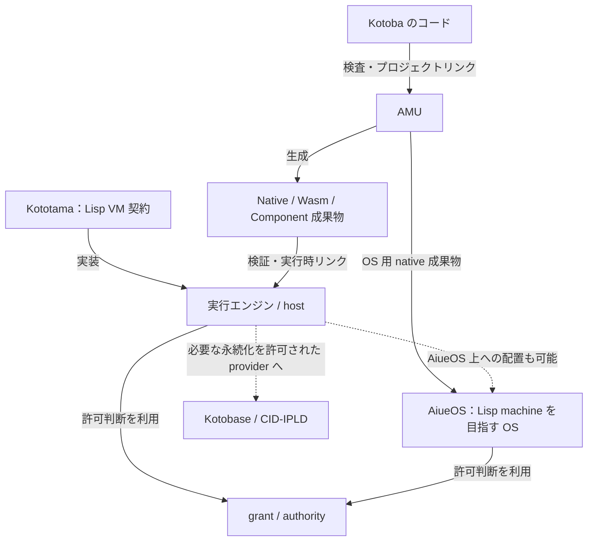
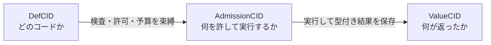

# Kotoba：現代の Lisp machine を組み立てる

構成をさらに整える[ターゲット非依存・分散アーキテクチャの構成方針](../stack-architecture-target-neutral.ja.md)：
WasmはAMUの出力先の一つ。中心に言語・VM・権限・identityの契約を置き、
WIT等はtarget profile、IPFS等は配布、inga等は宣言したdomainの合意として接続する。
実行targetと分散方式を独立に選び、各組合せのqualificationを明示する。

## 1. 全体像

**AiueOS は、Kotoba による現代の Lisp machine を目指す OS。**
Kototama はその計算モデルを担う Lisp VM 契約、AMU はコンパイラです。
Kototama には hosted engine もあり、すべての実行が AiueOS を必要とするわけではありません。

| 名前 | 役割 |
|---|---|
| Kotoba / kotoba-lang | コードを扱う言語・開発環境 / 言語仕様の正本 |
| AMU | 型・効果を検査し、成果物を生成する。プロジェクトリンクを担当 |
| Kototama | 閉じた S 式、状態遷移、予算、実行記録を定義する VM 契約 |
| runtime host | 契約を実装し、検証・実行時リンク・実行を担当 |
| grant / authority | 許可判断 / 権限範囲と委譲のモデル |
| AiueOS | 起動・メモリ・プロセス・デバイスを担い、許可判断を強制する OS |
| Kotobase | データ・状態・実行記録の永続化基盤 |
| sahai | 汎用の配置・lease・fencing。Murakumo は推論 fleet 自身の制御面を持つ |

## 2. 言語からコンピュータへ

矢印はラベルの関係を表します。これはソース依存グラフではありません。

## 3. Lisp machine としての新しさ

コードを値・構造として扱う Lisp の考え方を、型付き効果・能力ベースの権限・
内容アドレスと組み合わせます。実行対象、実行許可、結果を別々に識別します。

CID が分かることは実行許可ではありません。provider が無ければ実行を拒否します。
Kototama の admission core は Kotoba の閉じた述語と capability chain を使い、
Datalog と Biscuit は core の外側の query / adapter です。

## 4. 実装状況の伝え方

「現代の Lisp machine を目指す」は構成・方向を表す説明です。
統合 REPL・editor・debugger、稼働中の任意変更、heap・継続を含む image 復元、
selfhost、C-free 本番経路、実機 qualification はそれぞれ証拠を示します。
Codebase の保存を実行中 machine image の保存と呼びません。
QEMU・hosted・hybrid の成功を C-free 実機の完了と読み替えません。

## 5. 説明とリファクターの正本

[全体仕様と依存図](../stack-architecture.md) ·
[機械可読構成 spec](../../lang/stack-architecture.edn) ·
[全体リファクター手順](../stack-refactor-procedure.md)
