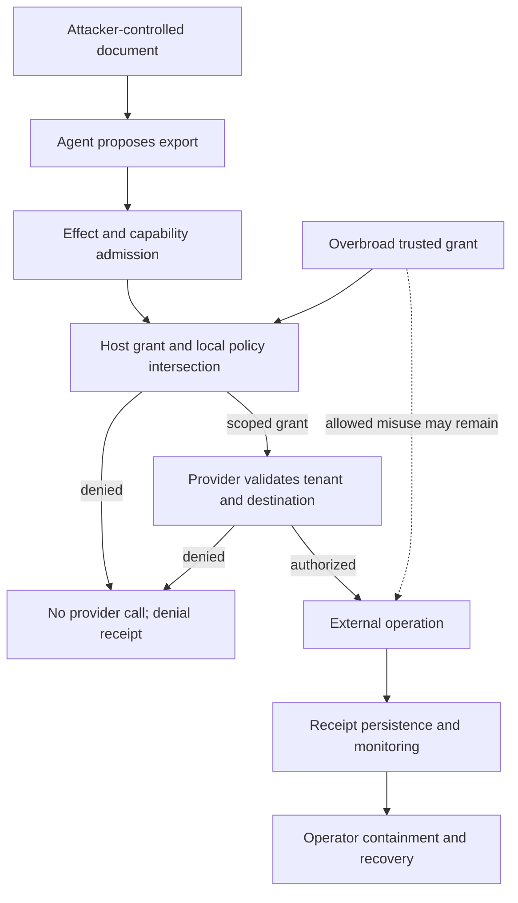

# Kotoba: scoped CSF 2.0 contribution and attack-path model

Assessment date: 2026-09-09. Source review plus local capability fixtures; no production attack testing, certification, or complete organizational CSF Profile. This is an explanatory model requested for publication, not a repository-wide vulnerability scan. Scenarios are hypotheses unless explicitly described as a local test result.

## Overview

The intended workflow is untrusted input -> AI proposal -> checked program -> explicitly authorized provider operation -> accountable result. These are separate trust boundaries. Kotoba Cloud does not currently claim a generic hosted production apply service. Kotobase data authorization and read auditing are distinct from the language host kernel.

The inspected immutable source identities are:

| Component | Revision | Source anchor |
|---|---|---|
| Language/host kernel | eb492e251b2e1d7d070bb7f1b3cca9bcc9914d6b | [capability_host.cljc](https://github.com/kotoba-lang/kotoba-lang/blob/eb492e251b2e1d7d070bb7f1b3cca9bcc9914d6b/src/kotoba/lang/capability_host.cljk#L19) |
| Cloud client/Worker | 7677a1084cf3bcdf776306075aef67281251e112 | [profile.cljc:100](https://github.com/kotoba-lang/app-kotoba-cloud/blob/7677a1084cf3bcdf776306075aef67281251e112/src/app_kotoba_cloud/profile.cljc#L100) |
| Identity/gateway/graph services | 380934ee43e1babfac055f20680802c978a047f5 | [auth.cljs:252](https://github.com/net-kotobase/control-plane/blob/380934ee43e1babfac055f20680802c978a047f5/kotobase-graph-database/src/kotobase/graph_database/auth.cljs#L252) |
| Assurance register | dd8c782bf0901c6065fdd1e45345a06641b4d316 | [remaining-operational-gaps.edn](https://github.com/kotoba-lang/security/blob/dd8c782bf0901c6065fdd1e45345a06641b4d316/registers/remaining-operational-gaps.edn) |

These identify inspected source, not verified deployed versions. Fresh main was also fetched for Cloud (928f95868cbe383af30fbe3b472b4fd9bc7c41e2) and control-plane (590cc8f99d23dcaf4a4b465a22a864c300ee47d8). The cited consumers retained their control flow; inspected differences were text-library imports and normalization names. This comparison is not runtime qualification of the replacement library. No third-party certification is inferred. The existing [standards assessment](https://github.com/kotoba-lang/security/blob/dd8c782bf0901c6065fdd1e45345a06641b4d316/docs/standards-assessment.md) is a design baseline, not live assurance.

| Workflow | Resource and configuration | Recipients | Enforcing control / evidence |
|---|---|---|---|
| Language host invocation | Requested resource intersected with supplied grants and local policy at supplied time | Concrete provider handler | `src/kotoba/lang/capability_host.cljk:40-69`; denial avoids handler; the trusted host supplies verified facts and correct time |
| Component import binding | Compiler binding receipt, required guard and concrete import set | Bound component dispatcher | `src/kotoba/lang/capability_host.cljk:168-273`; unknown imports are denied; weaker generic host helpers are not interchangeable with this component binder |
| Cloud session lookup | Fixed identity service, selected session cookie | Identity Worker | Cloud `session.cljc:6-7,28-41,70-83`, `worker.cljs:52-68`; a valid viewer is an identity projection, not operation approval |
| Cloud publication / key transitions | Per-principal Durable Object lifecycle and exact ML-DSA approved payload | Fixed publication upstream or key registry | Cloud `worker.cljs:215-266,287-332`, `pq_key_registry.cljs:57-79`; payload match, key epoch and replay state precede the operation |
| Public bootstrap | Fixed loader CID in public object binding | Anonymous readers | Cloud `worker.cljs:369-392`; existence/size checks and digest headers do not by themselves demonstrate client byte verification |
| Login nonce state | AuthnStore with expiring server-issued nonce | Identity Worker | Control-plane `authn/src/authn/store.cljs:21-25`, `authn/src/authn/siwe.cljs:245-267`; consume/check flow is distinct from authorization or delayed credential replacement |
| Graph read/write | Requested tenant, exact graph and action with configured public verification roots | Graph operation verifier | Control-plane `kotobase-graph-database/src/kotobase/graph_database/auth.cljs:252-305`; a client-supplied resource identifier is not authority |
| Read receipt persistence | Required/observe/off mode; signed and encrypted logical audit objects | Configured storage and audit readers | Control-plane `kotobase-graph-database/src/kotobase/graph_database/read_audit.cljs:222-242,325-344`; required mode rejects storage failure, other modes differ |

The exact physical storage prefix, complete decryptor access set and current deployed bindings were not established. A same-operator relay is not independent audit custody. A source-level receipt gate does not establish pager delivery, incident response or a successful restore.

## Threat model, trust boundaries and assumptions

**Assets:** customer data, tenant isolation, signer and credential state, approved artifact bytes, operation budgets, service availability and reliable audit evidence.

**Attackers:** an unauthenticated HTTP caller; an authenticated caller restricted to its own tenant; a publisher controlling an untrusted artifact; or an adversary controlling text an agent reads. None is assumed to own the host, verification keys, policy or production release account. A trusted-host compromise changes the starting authority and cannot be dismissed by a language-level grant check.

**Objectives:** distinguish text from authority; bind principals to verified credentials; bind operations to exact resources and permissions; prevent unapproved provider invocation; validate content identity separately from signer trust; meter the actual runtime; and retain usable evidence of actions and failures.

**Established scope:** the host kernel returns receipts, but `record!` is optional and the helper journal is an atom (`capability_host.cljc:19-69,275-285`). It is not durable or independently protected. Component binding enforces a stronger contract than the generic helper. Providers still own redirect, path/symlink, tenant and secret-use checks; the caller owns correct policy and verified input facts. The compiler, verifier, runtime, provider, key custody and OS remain trusted dependencies.

**Deployment and documentation differences:** the Cloud public profile sets `hostedApply=false`; real inspected hosted mutations include library publication and key transitions, not arbitrary deployments. Cloud SECURITY.md still describes Passkey-only while its client supports wallet sign-in and workspace policy permits verified SIWE. This is a documentation/implementation alignment gap, not evidence that login can authorize any action. The graph configuration contains distinct legacy/public, required-authorization and warning-mode settings; it must not be summarized as universally sealed or universally fail-closed. Development-only identity switches in gateway source are not evidence they are enabled in production. Wallet phrase sign-in restores an existing signer; it does not prove the separately specified delayed identity-credential replacement process.

An independent fresh-context source reviewer mapped Cloud and control-plane boundaries. The parent checked representative consumers and source anchors. Imported libraries outside those scoped repositories, all authentication routes, physical storage mapping, complete recovery and production deployment equivalence were not audited.

## Attack surface, mitigations and attacker stories

| Priority | Scenario and new capability sought | Prerequisites / impact | Existing controls | Mitigation and required evidence |
|---|---|---|---|---|
| High | Injected document induces customer-data export | Agent reads attacker text; a connected provider could export sensitive data | Declared effects and guarded resource intersection; language `capability_host.cljc:40-69,105-136` | Narrow destinations and data scope, exact-operation approval and host isolation. Check denied handler count. Broad granted export remains possible. No live injection rejection was tested. |
| High | Tenant caller reads or modifies another graph | Reachable endpoint and an authorization failure would cross tenant ownership | Graph `auth.cljs:252-305`; representative write `xrpc.cljs:1296-1325` | Per-route principal/tenant/graph/action negative tests, including read-to-write escalation. Source review of one consumer is not whole-service isolation evidence. |
| High | Approved artifact is substituted | Intermediary controls delivered bytes; execution of different bytes | Cloud binds an approved signed publication record, not execution-time bytes or builder integrity, through payload equality and scoped ML-DSA approval, `worker.cljs:287-332`; language supply-chain claim identifies signer/clock/revocation dependencies in `lang/safety-claims.edn:54-63` | Bind expected digest and exact approved revision, verify signer status at consumption, qualify the builder. Trusted malicious signing remains a risk. |
| High | Revoked or previously consumed approval is replayed | Caller retains valid old message; duplicate mutation or stale authority | Cloud transactional lifecycle `pq_key_registry.cljs:57-79` plus `pq_key_lifecycle.cljc:33-60,67-113`; host expiry intersection | Test concurrent replay, epoch transitions and measured revocation delay. Generic host receipts alone do not prevent replay. |
| Medium to High | Resource exhaustion disrupts service | Attacker-controlled work reaches admission or runtime | Finite-bound design with backend-specific tests, `lang/safety-claims.edn:45-53` | Measure actual backend fuel, memory, output and supervisor deadlines under load. Network flooding and engine vulnerabilities need other defenses. |
| Medium to High | Operation succeeds but audit evidence is lost | Recorder failure or log tampering obscures an incident | Host returns receipts; configured graph read-audit required mode rejects persistence failure | Durable protected sink, write-action failure semantics, independent retention, pager tests and restore exercises. Do not apply the read-audit result to every write path. |

These are defensive acceptance scenarios, not asserted vulnerabilities. Tests should use synthetic data and isolated providers; no exploit traffic was sent to live services.

### Current-to-target CSF contribution map

[NIST CSF 2.0](https://doi.org/10.6028/NIST.CSWP.29) organizes organizational outcomes. The following is our selected mapping, not a NIST endorsement, complete Profile or conformance score:

| Function / selected outcome | Current evidence in scope | Target acceptance evidence |
|---|---|---|
| GV / GV.PO-01 | Governance and risk policy documents | Accountable owners, reviewed exceptions and recorded approvals |
| ID / ID.AM | Manifests and content identities | Deployed asset/data inventory and ownership |
| PR / PR.AA-05 | Scoped grant and backend action checks | Qualified bindings and tenant/privilege tests for each deployed route |
| DE / DE.CM-09 | Receipt producers and selected persistence gates | Durable telemetry, useful alerts and responder readback |
| RS / RS.MI-01 | Response/containment design | Exercised containment, communications and bounded revocation delay |
| RC / RC.RP-03 | Content integrity mechanisms | Protected restoration assets, successful restore and validated recovery objectives |

NIST does not certify CSF products or implementations: [official FAQ](https://www.nist.gov/cyberframework/faqs). The existing SOC/ISO register is separate: the checker run at 254bf4da3b792d4068abab5a4752d8a0e5e03fda reports design/implementation evidence and zero operating evidence for its encoded controls; it is not a CSF completion metric. The evidence index, crosswalk policy and operational-gap register were byte-identical in freshly fetched main dd8c782bf0901c6065fdd1e45345a06641b4d316.

Local verification at the language revision: `scripts/verify_capability_conformance_cljs.cljk` passed 24 expected verdicts (9 component-binding, 2 host-dispatch). Its `.cljc` kernels ran under nbb with the coll, text, grant, identity and authority source dependencies. This verifies allow/deny fixture behavior, not a compiled-artifact attack test, production host wiring, or cross-runtime byte equality. Initial attempts without the dependency classpath could not run and were not counted as passes.

## Severity calibration

- **Critical:** a demonstrated unauthenticated path to arbitrary trusted-host execution or widespread cross-tenant secrets, without already holding that authority. No such finding was established here.
- **High:** verified tenant-crossing reads/writes or publication beyond an exact approved payload, with a reachable consumer. A guessed resource identifier that the backend denies is counterevidence, not an exploit.
- **Medium:** bounded service disruption or incomplete evidence affecting a real deployment, dependent on demonstrated reachability and compensating controls. A missing optional recorder in a library is a caller obligation until a deployment promises durability it does not provide.
- **Low:** limited information or operational friction without meaningful privilege gain. Existing operator control, self-only changes and an approved action within its granted scope do not become privilege escalation merely because an AI proposed them.

Impact, confidence and missing deployment evidence remain separate. Next acceptance work is a scoped synthetic enterprise pilot: bind principal, artifact, policy, resource and environment; exercise allow/deny, concurrent replay, revocation, recorder failure and restore; report missing receipts, unauthorized handler calls, revocation delay and recovery time.
