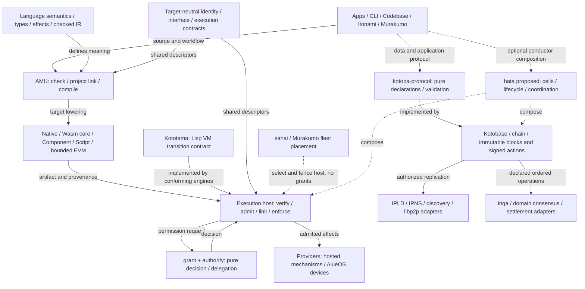
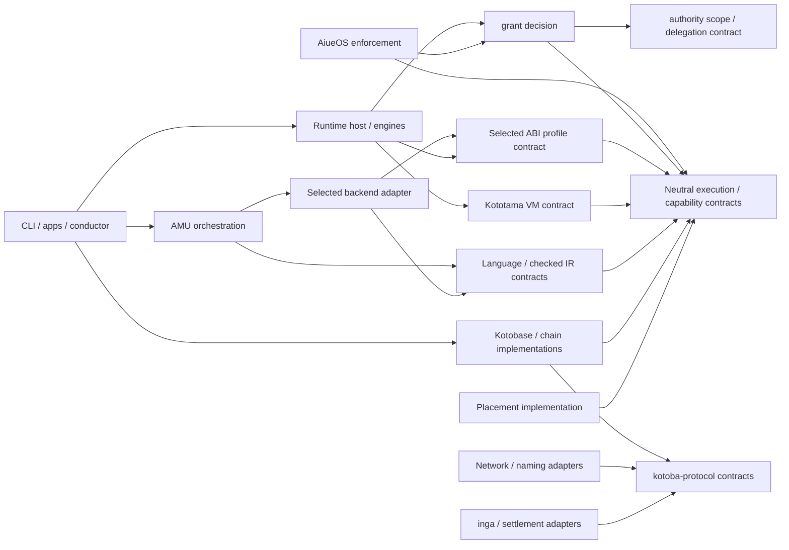
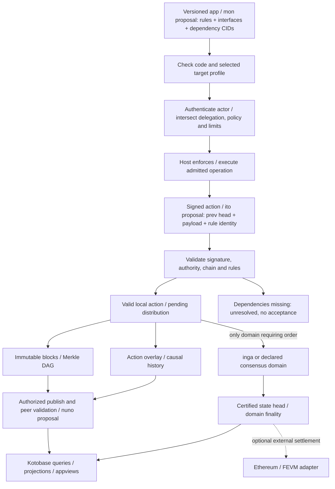

# Kotoba全体構成：ターゲットから独立した計算と分散

Status: **採択した構成方針** · 2026-10-10。責務の整理方針であり、実装移行や新しい実行保証の完了を意味しない。
[機械可読spec](../lang/stack-architecture-target-neutral.edn)と対になっている。
[現行構成と日付付き依存観測](stack-architecture.md)は別に保持する。
[今回の変更・検証レポート](stack-architecture-target-neutral-report.md)も参照。

## 推奨する構造

**中心はターゲット非依存の意味・identity・authority契約。AMUがその意味を各ターゲットへ写像し、
実行hostが許可を強制する。分散プロトコルは、その計算とデータをノード間で共有する。**

`abi → 言語 → compiler → VM → OS → 分散`という一本の階段では表現しない。
T0–T6は現行の責務ラベルであり、依存順位や全体の基底を意味しない。
言語・VM・permission・データプロトコルの正本は各ownerに残す。
「美しい依存関係」の基準は、小さな契約へ依存が向かい、具体的な機構がその契約を実装することに置く。

### 全体構成図

この図は**責務と接続点**。線はsource importではなく、図中のラベルに示す関係。
各実行profileが必要な部分を選ぶ。全ノードが全機構を持つ必要はない。

AiueOSは「Kotoba Lisp machineのOS」、Kototamaは「Lisp VM契約」、AMUはcompiler。
分散実行でもこの関係は変わらない。hosted実行にAiueOSは必須ではない。
EVM bytecodeを実行するEthereum hostはEVM規則に従う。AMUがEVMを出力できることだけで、
そのhostがKototamaの全VM契約を実装すると扱わない。

## abiをどう整えるか

ABIそのものを不要にするのではない。**意味上のinterfaceと、物理的な呼出し規約を分ける。**
現在の`abi`はWITと共通descriptorの両方を持つため、丸ごとの移動では境界が改善しない。

| 契約の種類 | 整理後の役割・owner案 | 含めないもの |
|---|---|---|
| 言語の意味 | `kotoba-lang`と既存semantic/IR owner | WIT、ISA、socket、永続DB |
| source/package/capabilityの共通契約 | 既存`kotoba-core-contracts`を使用。能力の意味は言語catalogと整合させ、重複定義しない | engine、provider handle、OS実装 |
| VM状態・遷移・admission | `kototama`のVM spec。判定policyは`grant`、委任modelは`authority` | compiler backend、OS、network node |
| 共通execution descriptor | `abi`内のtarget-neutral部分を明示し、完全な移動単位を決めてから`kotoba-core-contracts`へ移管する候補 | Wasm worldを全profileの必須項目にすること |
| target ABI/profile | `abi`をversioned profileのownerとして残す。WIT/Canonical ABI、native calling convention、Script bridge、EVM ABIをそれぞれ区別 | 全targetの意味をWasmから導出すること |
| 分散application/data契約 | `kotoba-protocol`。bytes/CID・署名・暗号の実装は既存codec/crypto owner | DHT、DB、consensus実装の取り込み |

移管先は「すべてのspecを置く巨大なcore」ではない。共通descriptorだけを扱い、language/VM/protocolの
正本を吸収しない。既存`kotoba-core-contracts`にもcodec・署名・I/O等の依存があるため、
移管前にcontract-only入口とadapter入口のtransitive closureを測定する必要がある。

当面は新repoや一括改名を作らず、`abi`内でneutral contractとtarget profileの入口を分離する。
repo単位で分離する場合も、独立consumerとrelease境界を確認してから決める。
native ABIの機構ownerはnative backend/hostに残し、`abi`は共有する規約だけを持つ。
Scriptも既存bridge規約を明示し、JavaScript hostそのものを基底にしない。

現行`execution-identity`は`:component-cid`・`:wit-world-cid`を含み、lease等もcomponentを参照する。
したがって**現在のdescriptorは完全にtarget-neutralではない**。
新versionでは共通部にsemantic interface identityを置き、profile部にtarget契約とartifact identityを束縛する案とする。
未知profile・未認定operationは拒否する。既存v1/v2、`:aiueos/*` wire key、CID算出規則は互換移行まで保持する。
この構成方針は実際の新schema、field名、hash domainを制定しない。

WITはComponent interface/worldを記述し、Canonical ABIがそれをcore Wasmの値とmemoryへ写像する。
このため、WITを全ターゲットの言語意味の正本に置かない。
[WIT](https://component-model.bytecodealliance.org/design/wit.html)・[Canonical ABI](https://component-model.bytecodealliance.org/advanced/canonical-abi.html)。

## 意図する依存関係

以下は**移行後の契約依存の方向**であり、現在の`deps.edn`一覧ではない。
矢印はconsumer → dependency。ノードはrepo全体ではなく、明示したcontractまたはadapter入口を示す。
implementationは必要な契約を直接参照してよいが、契約がimplementationを逆importしない。
VMとcompiler IRは別の契約であり、VM正本をcompiler実装に依存させない。

contract packageには必要な純粋codec等の明示依存を認める。この図は全transitive lockではない。
禁止する逆依存は、neutral contract → WIT/ISA/provider/DB/consensus、language → network runtime、
grant → OS/engine、protocol → socket/永続DB/consensus implementation。
conformance/test/buildのalias依存はproduction依存と別に記録する。
現行のlanguage→grant/osaho、AMU→abi/backends、Kototama→grant/authority/kotoba-vm等は
[現行spec](../lang/stack-architecture.edn)の観測として残り、この図によって消えない。

## Holochain・IPFS・EVMを組み合わせる境界

| 参考にする構造 | Kotobaへの設計上の対応 | 分ける保証 |
|---|---|---|
| Holochainのintegrityとcoordinator、署名付きsource chain、DHT validation | immutableな規則bundleとeffectfulなcoordinationを分ける。mon/ito/nuno/hataの既存提案へ接続 | validation成功は全体の順序確定ではない |
| IPFS/IPLDのCID・Merkle DAG・routing/retrieval | code・artifact・state・receiptを明示したcodec/hashで同定する。IPNSは可変head、DHT/IPNIは発見、BlockStore/pinningは保持 | CIDは署名、認可、可用性、秘匿性を保証しない |
| EVMの決定的state transitionとmetering | Kototamaのbounded transitionとbudget設計の参考。必要なdomainのみinga等でorder/finalityを合意する | 実行fuel、chain gas、課金creditは別単位 |
| Ethereum/EVM連携 | AMUのbounded EVM outputと、外部chainへのsettlement adapterを別々に選ぶ | compiler targetとconsensus networkは別の依存 |

Holochainではintegrity側がvalidationを担い、source chainやDHT上の依存を参照する。
不足した依存は未解決として扱う。
[validation](https://developer.holochain.org/build/validation/)・[validate callback](https://developer.holochain.org/build/validate-callback/)。
IPFSはcontent addressing/routing/transferのprotocolであり、保持はpinning等の別の責任である。
[CID](https://docs.ipfs.tech/concepts/content-addressing/)・[persistence](https://docs.ipfs.tech/concepts/persistence/)。
EthereumではEVMの状態遷移とgas、consensus mechanismを分けて説明している。
[EVM](https://ethereum.org/developers/docs/evm/)・[consensus](https://ethereum.org/developers/docs/consensus-mechanisms/pos/)。
これらへの対応はKotobaの設計提案であり、protocol互換性や実装済み機能の主張ではない。

### 分散書込みと実行の流れ

この図の矢印は**データ・検証の流れ**。source import図とは方向の意味が異なる。

effectの外部実行・action commit・複製は自動的に一つのatomic transactionにはならない。
非可逆effectにはintent、idempotency、receipt、失敗時の回復を定義し、合意が必要な操作は
確定前に外部effectを起こさない。consensus domainが指定されていれば、そのdomainの定める
propose/order/execute/commit順序に従う。この一般図でその順序を上書きしない。

Merkle linkを変えると親CIDが変わる。action/overlay linkは参照対象のCIDを変えず、
署名付きhistoryとそのcommit/headを進める。object CID、action identity、graph commit、
mutable name、transport locationは別の座標である。
DefCID・AdmissionCID・ValueCIDも区別し、target artifact CIDやexecution receiptと混同しない。

グローバルな分散合意を扱う入口は残す。policy更新、共有assetの二重使用防止、決済、
共通head等には明示したconsensus domainが必要であり、DHT複製だけでは代用できない。
独立したagent historyやimmutable contentの配布を、そのdomainのtotal orderへ強制しない。
確定性の必要な書込みはdomainを省略してcausal扱いへfallbackしない。
policyの根拠・version・適用開始・失効を束縛し、chain間のfinalityはbridge固有のtrustを明示する。

private/sealed contentはclient-held keyで暗号化し、公開可能なmetadataを別途宣言する。
discoveryやreceiptにsecret/provider handleを載せない。署名は行為の真正性を検証する材料であり、
その行為が許可されるかは別に判定する。

## Profileを組み合わせて使う

| 選択軸 | 例 | 他の軸への暗黙依存 |
|---|---|---|
| 実行target | host-native、Wasm core、Component、Script、bounded EVM | Wasmを選んでもIPFS・Ethereumは必須にならない |
| execution host | hosted engine、browser/Worker、AiueOS、external EVM | AiueOSを選んでもDHTや全体consensusは必須にならない |
| data/distribution | local-only、sealed replication、agent-centric sharing | IPFS配布はWasm実行を要求しない |
| consistency | local、causal、declared ordered consensus、external settlement | domainの保証をprofileに明記し、勝手に弱めない |

全組合せがサポートされるわけではない。選択したtarget×host×operation×consistencyごとの
qualificationが必要。異なるtargetで同じvalue/stateを保証する範囲は、数値・encoding・metering等の
versioned contractとconformance vectorsで定める。fuelやfloating pointを無条件に同一視しない。

AMUの現行READMEにはnative/Wasm/Component/Scriptと限定EVM経路がある。
EVMは`:evm256-kotoba-v1`のpure・引数なし`main() -> int64`の限定sliceで、storage、external call、
capability等を拒否する。完全なdecentralized application targetと宣伝しない。
[AMU owner](https://github.com/kotoba-lang/amu/blob/f97f399bbd33664965be1cb25fb14121f2eedb89/README.md)。

## 仕様と移行の順序

1. `abi`の全export/schema/WITと全consumerを棚卸しし、neutral・profile・混在に分類する。
   `execution-identity`、lease、approval、authority eventの閉じたfield集合を含める。
2. capability/semantic interfaceとprofileの対応、target artifact binding、codec/hash/versionを制定する。
   既存identityを保持する移管と、新identityが必要な意味変更を区別する。
3. neutral入口とtarget profile入口を分離し、既存consumer用の互換facadeを維持する。
   共通契約の候補移管先は`kotoba-core-contracts`。versioned契約とclosure確認前には移さない。
4. AMU/backendとruntime/OS consumerを対応するprofile単位で更新する。contract→adapterの逆importを禁止する。
5. `kotoba-protocol`のapp/data契約とhata/mon/ito/nuno提案を接続し、未実装の機能を明示する。
   consensus契約はinga、実ネットワークやcryptoは既存ownerに残す。
6. 同じ意味のpositive vectors、未知profile・provider不足・権限拡大・fork・replay・期限切れ・
   unavailable dependency・finality不足の拒否を確認する。実際のtarget出力と実行で検証する。
7. [全体refactor手順](stack-refactor-procedure.md)に従い、正本・説明・pin・qualificationを順に更新する。
   Q9はwhole-component/JVM-free。文書の変更だけを実装移行と数えない。

## 現在の根拠と残る判断

2026-10-10にfetchしたmainを確認：language `f9ca6806793c`、AMU `4eb6c3f767ab`、
abi `af5e5379d767`、core-contracts `e2b3a74f9591`、protocol `fd6a0c0fc668`。
関連13 ownerの直接依存とaliasを再計測した[観測spec](../lang/stack-dependency-observation.edn)と[現在の依存図](stack-dependencies-current.md)を併記する。全transitive closureや実行qualificationの再計測ではない。
ingaのmainも取得して責務を確認した。accountability ADRは設計根拠であり、その暗号・合意のqualificationを再確認したものではない。
旧composition specの8 manifests/23 selected edgesは旧観測として保持する。

今後決める点は、共通descriptorの移管範囲、schema versionとhash domain、native/Script profileの共通化範囲、
VM conformanceのtarget別対象、consensus domainのmembership/finality/recovery、
hata/mon/ito/nunoの正式なowner/API。これらを設計図だけで決定済みにはしない。

参照：
[core-contracts](https://github.com/kotoba-lang/kotoba-core-contracts/blob/e2b3a74f959142da054605b5c1c053a19edac494/README.md)、
[abi descriptors](https://github.com/kotoba-lang/abi/blob/af5e5379d767c9172ddecbec1b2e76b84fdc58f6/src/kotoba/abi/contract.cljk)、
[protocol planes](https://github.com/kotoba-lang/kotoba-protocol/blob/fd6a0c0fc66803e5693486eb741c9d508c129ff5/src/kotoba/protocol/layers.cljk)、
[inga](https://github.com/kotoba-lang/inga/blob/main/README.md)、
[accountability proposal](https://github.com/kotoba-lang/kotoba/blob/main/docs/ADR-accountability-tiered-anonymity.md)。
