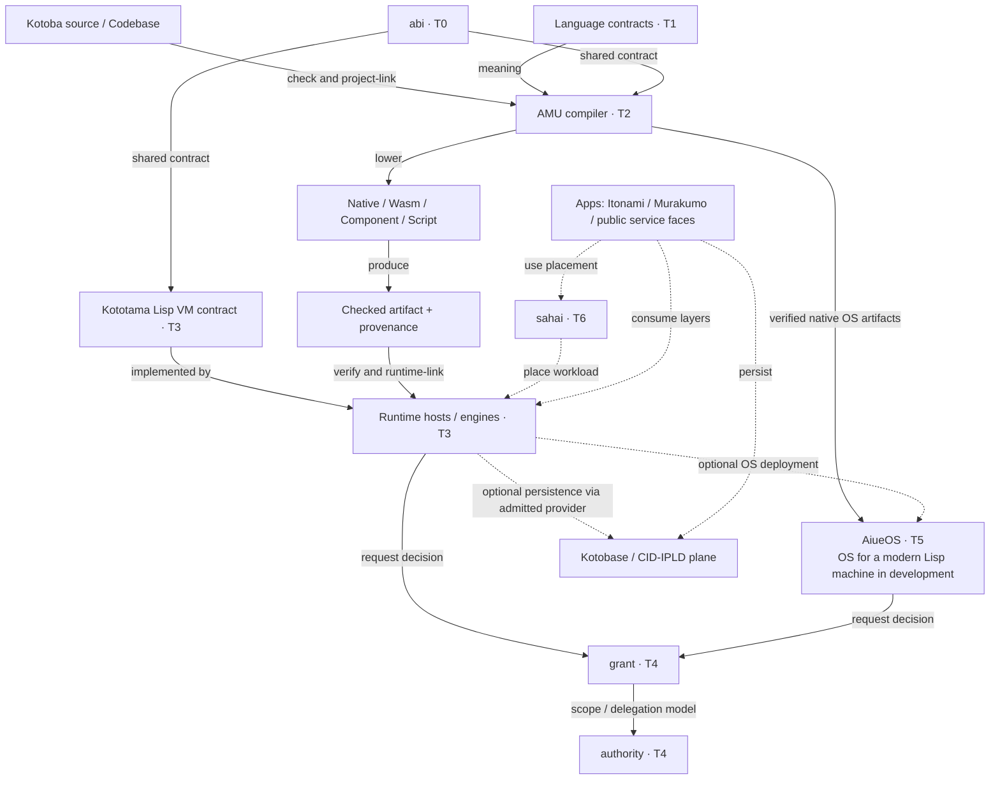
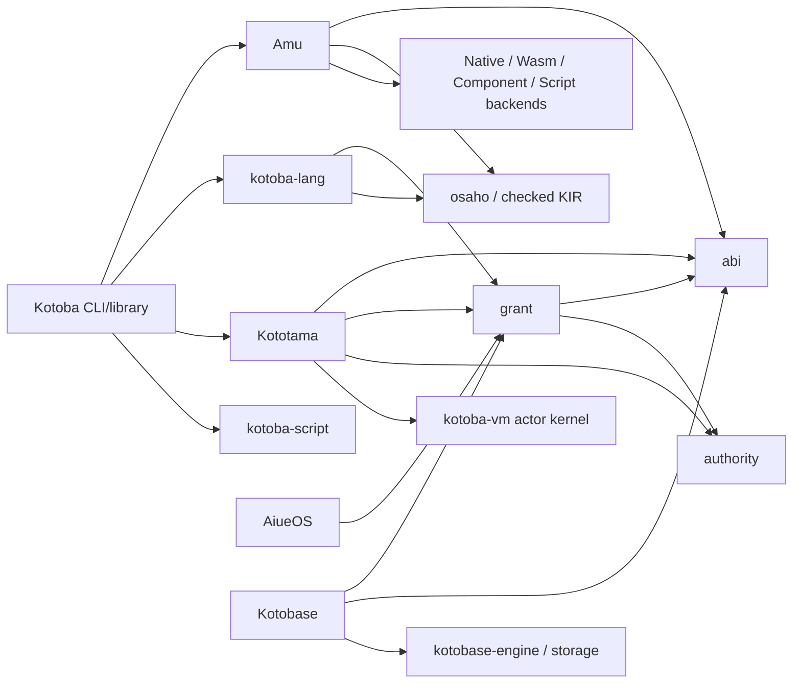

# Kotoba stack architecture

Kotoba is a language-centred computing stack. AiueOS is the OS for a modern
Kotoba Lisp machine in development; Kototama is the Lisp VM contract; Amu is
the compiler. Grant decides permission, and runtime hosts and the OS enforce
it. Hosted Kototama engines can run without AiueOS.

The machine-readable [composition contract](../lang/stack-architecture.edn)
routes to owner specifications. Root's
[responsibility legend](https://github.com/com-junkawasaki/root/blob/main/manifest/kotoba-stack-legend.edn)
and [topology ADR](https://github.com/com-junkawasaki/root/blob/main/90-docs/adr/2607241100-kotoba-stack-topology-and-design-cleanup.kotoba)
remain the workspace governance authorities. Composition does not redefine
language semantics, VM transitions, authorization or OS qualification.

## Responsibility map

| Component | Owns | Boundary |
|---|---|---|
| kotoba-lang, T1 | Language specification and semantic contracts | No VM or database is the language definition |
| Kotoba CLI/library/Codebase | User commands, libraries, content-addressed definitions | Calls the compiler and runtime; separate from the T1 authority repo |
| abi, T0 | WIT, capability and admission interchange contracts | Contract data, no permission decision or engine |
| Amu, T2 | Checking, project linking, lowering and artifact production | Does not schedule work or decide grants |
| Kototama, T3 | Closed S-expression transitions, IPLD state and receipts | VM contract; engines implement it |
| Runtime hosts, T3 | Validation, runtime linking, budgets and execution | Implement a named profile and enforce admitted capabilities |
| grant / authority, T4 | Permission decisions / scope and delegation model | Grant returns data; it does not execute |
| AiueOS, T5 | Firmware, memory, processes, devices and OS mechanisms | Enforces grant decisions; not the grant authority |
| sahai, T6 | Reusable placement, leases and fencing | Placement grants no authority |
| Kotobase | Database, query and persistent state | Data foundation, not mandatory language semantics |
| Apps and services | Product workflows and public entry points | Apps consume lower layers; domains are locations |

Murakumo is an inference network with its own fleet control plane, using
placement machinery; it is not the universal T6 owner. Itonami carries agent
work and app entry points. Kotoba Cloud is an entrance to services, not an
implicit grant authority. Hata is a proposed conductor, not a shipped engine.
The app, responsibility, data and communication axes in the root legend are
separate axes; a diagram must say which one it shows.

## Execution and artifact flow

Solid labelled arrows describe operations or artifact consumption. Dashed
arrows describe optional deployment composition, not source imports.

This is a composition diagram, not proof that every engine/provider/OS path
is implemented or deployed. Native host defaults and portable Component
profiles are target choices; neither changes the VM definition.

## Selected direct library dependencies

Here an arrow means **consumer → direct dependency**. This graph is an
observation of fetched `main` manifests on 2026-10-10, not a timeless policy
or a complete transitive lock. Alias-only build, conformance and integration
edges are recorded separately in the composition contract.

Existing T1 dependencies on grant and checked KIR must remain visible during
refactoring; this report neither erases them nor certifies T1 isolation.
Kotobase's language integration edge is alias-scoped; “database built on the
language” does not mean every database repo directly imports the CLI at runtime.
Amu's backend and ABI dependencies refute the old “security and Script only”
snapshot. Kototama imports grant, not the OS, for permission decisions.
The booted AiueOS kernel consumes verified compiler output, while host-side
build aliases may depend on compiler libraries.

## What the Lisp machine presentation means

The primary system story is **AiueOS: OS for a modern Kotoba Lisp machine in
development**. The computational story is **Kototama: Kotoba Lisp VM contract**.
Amu remains the compiler and project linker; it is not an abstract machine.

Lisp-like code values, closed S-expressions and explicit code environments are
combined with typed effects, bounded capabilities and content identity.
`eval` selects checked code using DefCID; AdmissionCID binds interface,
effects, allowance and limits; ValueCID identifies the typed result. A missing
provider refuses execution. The [typed eval contract](../lang/typed-eval.edn)
and [VM specification](https://github.com/kotoba-lang/kototama/blob/main/spec/kototama-vm-v1.edn)
own those details. Current VM admission is a closed Kotoba predicate over a
capability chain; Datalog queries and Biscuit adapters are outside that core.

This architectural framing supplies no new evidence for a complete integrated
REPL/editor/debugger, arbitrary live system modification, heap/continuation
image save and restore, selfhost, C-free production or physical-machine
qualification. A Codebase commit is not a running heap image. Cite each
owner's current profile, artifact and receipt when making a completion claim.

## Refactor and presentation entry points

- [Whole-stack refactor procedure](stack-refactor-procedure.md)
- [Japanese presentation narrative and diagrams](presentations/kotoba-lisp-machine.ja.md)
- [Documentation authority routing](authority-map.edn)
