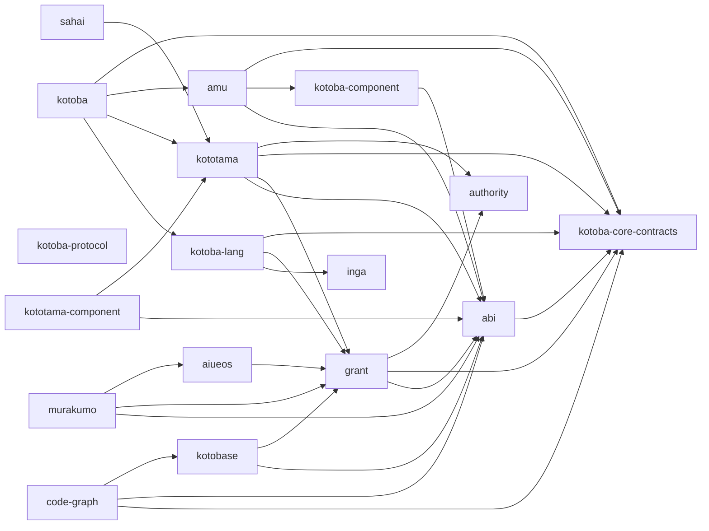
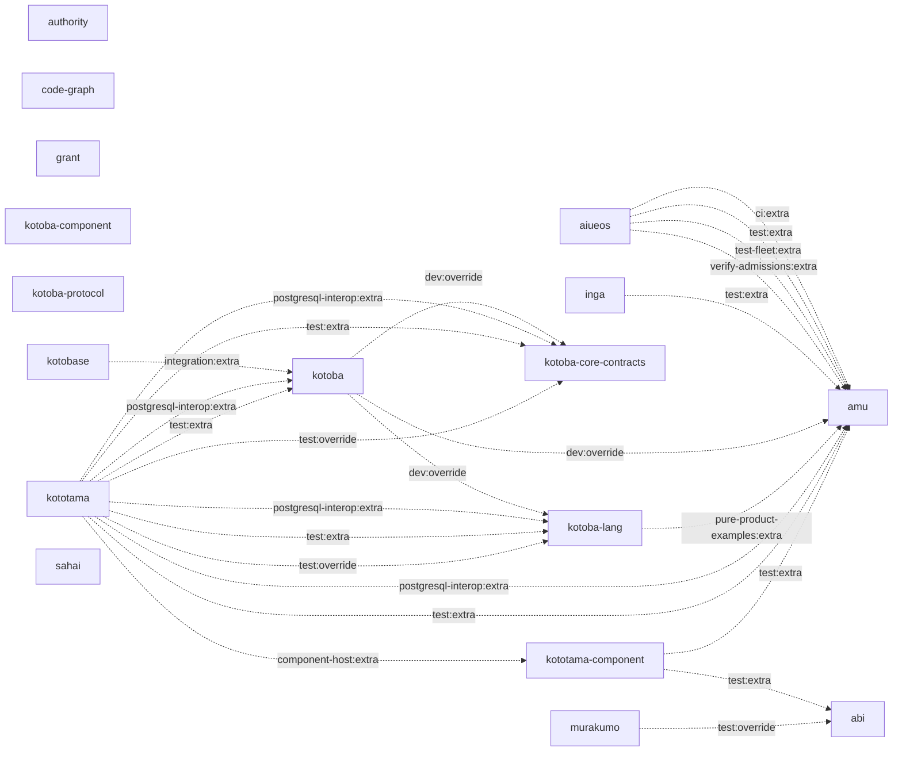

# Current selected owner dependencies

Measured 2026-10-10 from 17 immutable owner source revisions; each revision is recorded in the [observation spec](../lang/stack-dependency-observation.edn). Arrows mean consumer → dependency. All coordinates and alias extra/replace/override descriptors are recorded. This selected graph is not a transitive lock or runtime qualification.

Production dependencies (31 selected direct edges):

Build/test/integration aliases are a separate graph:

Repo-level edges include multiple entrypoints. The neutral `kotoba.core.execution` namespace has no imports, while other core-contracts codec/crypto entrypoints have their own dependencies. `abi.component` imports that neutral namespace; the legacy facade imports both. The language's existing grant/osaho coupling remains visible. Alias cycles do not redefine the acyclic intended contract DAG. Compiler backends and IR libraries outside this selection remain in the complete coordinate records.

See [the implemented API split](stack-architecture-target-neutral-report.md) and [the intended contract architecture](stack-architecture-target-neutral.ja.md).
