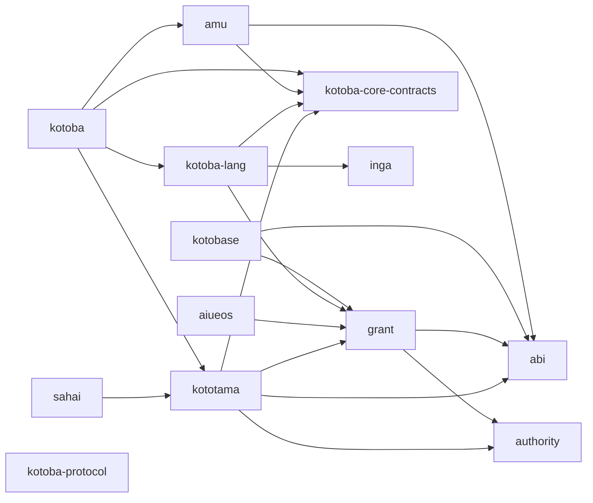

# Current selected owner dependencies

Measured 2026-10-10 from 13 fetched-main owner manifests. Arrows mean consumer → direct dependency among the selected owners. This is a dated observation, not the intended contract DAG or a transitive lock. Alias extra/replace dependencies and all declared coordinates are recorded in the [observation spec](../lang/stack-dependency-observation.edn).

The selected graph contains 19 edges. Compiler backend and IR repos outside this 13-owner selection remain present in the full declared coordinates in the observation spec. This graph does not prove semantic isolation: the language still has grant/osaho dependencies, and abi mixes shared descriptors with target profiles. Test/build aliases can introduce additional compiler/integration edges.

The [adopted target-neutral contract architecture](stack-architecture-target-neutral.ja.md) supplies the direction for future migration; neither a tier label nor an architecture drawing removes today’s dependencies.
